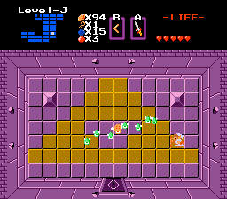
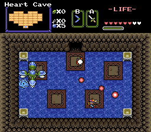
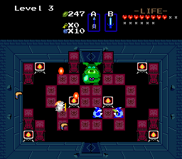
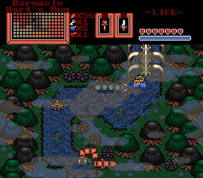
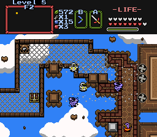

# Zelda Classic
Zelda Classic 2.10 was released for Windows, MacOS, and DOS in 2005. This code represents the last service release of that version (2.10.3) which fixes a number of small issues. 

Homepage:
http://zeldaclassic.com

### Screenshots

  
 

## Building the Source

This codebase is not actively maintained and is for archival purposes only. If you wish to compile the code you will need the libraries from the 2.50 repository and use the makefile provided here; in other words, you are on your own.

## License

This program is free software: you can redistribute it and/or modify
it under the terms of the GNU General Public License as published by
the Free Software Foundation, either version 3 of the License, or
(at your option) any later version.

This program is distributed in the hope that it will be useful,
but WITHOUT ANY WARRANTY; without even the implied warranty of
MERCHANTABILITY or FITNESS FOR A PARTICULAR PURPOSE.  See the
GNU General Public License for more details.

